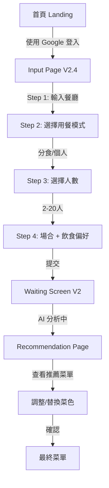

# Carte AI - UI/UX 設計簡報
## 完整專案設計指南 v2.4

**專案名稱**: Carte AI 點餐助手  
**當前版本**: Input Page V2.4 + Waiting Screen V2  
**設計風格**: Modern Bistro Editorial  
**目標平台**: Web (桌面 + 手機)

---

## 📋 1. 專案背景

### 產品定位
**AI 驅動的餐廳點餐推薦助手**

- 🎯 **核心價值**: 解決「看不懂菜單」、「選擇困難」的用餐痛點
- 🤖 **技術特色**: 使用 Gemini AI 分析餐廳菜單 + Google 評論
- 🍽️ **目標場景**: 中高級餐廳、多人聚餐、商務宴請

### 用戶痛點
1. 菜單項目太多，不知道該點什麼
2. 不了解餐廳招牌菜、隱藏菜單
3. 多人聚餐時難以平衡口味
4. 預算控制與份量計算困難
5. 飲食限制（素食、過敏）需要特別注意

### 產品特色
- ✨ **即時分析**: 輸入餐廳名稱，AI 立即分析菜單
- 🔍 **智能推薦**: 基於人數、場合、飲食偏好精準推薦
- 📊 **評論整合**: 自動讀取數百則 Google 評論
- 🎨 **視覺化呈現**: 卡片式菜單，清晰易讀
- 🔄 **即時調整**: 可替換菜色、追加點餐

---

## 🎨 2. 當前設計系統

### 色彩系統 - Modern Bistro Palette

#### 主色調
```
Charcoal (炭黑)  #2C2C2C
├─ 用途: 選中狀態、確認按鈕、標題
├─ 心理: 專業、權威、高級感
└─ 對比度: 21:1 (WCAG AAA)

Caramel (焦糖)  #D4A574
├─ 用途: 強調色、進度條、圖標
├─ 心理: 溫暖、美味、誘人
└─ 對比度: 4.8:1 (WCAG AA+)

Terracotta (陶土紅)  #C77B5F
├─ 用途: 多選標籤、輔助選擇
├─ 心理: 工藝感、真實、溫度
└─ 對比度: 4.5:1 (WCAG AA)

Cream (奶油米色)  #F9F6F0
├─ 用途: 主背景
├─ 心理: 優雅、復古、溫馨
└─ 靈感: 高級餐廳菜單紙張
```

#### 中性色
```
Gray-50:  #F7F7F7  (淺灰背景)
Gray-200: #E5E7EB  (邊框)
Gray-500: #6B7280  (副標題)
White:    #FFFFFF  (卡片、未選中狀態)
```

### 字體系統

**Display (標題)**
- 字體: Cormorant Garamond (Serif)
- 用途: 頁面主標題、步驟標題
- 特性: 優雅、編輯感、雜誌風

**Body (內文)**
- 字體: Inter / 系統默認 Sans-serif
- 用途: 按鈕、說明文字、卡片內容
- 特性: 清晰、易讀、現代

**中文字體**
- 預設使用系統字體
- 建議: Noto Sans TC / PingFang TC

### 陰影系統
```css
shadow-sm:       小元素 (0 1px 2px)
shadow-md:       卡片 hover (0 4px 6px)
shadow-lg:       按鈕 (0 10px 15px)
shadow-xl:       按鈕 hover (0 20px 25px)
shadow-floating: 主卡片 (0 25px 50px -12px)
shadow-inner:    輸入框內凹 (inset 0 2px 4px)
```

### 圓角系統
```
rounded-lg:      12px (標籤、小按鈕)
rounded-xl:      16px (輸入框)
rounded-2xl:     24px (選項卡片)
rounded-[2rem]:  32px (主卡片)
rounded-full:    9999px (CTA 按鈕、Pills)
```

---

## 🗺️ 3. 用戶流程

### 主流程 (Happy Path)



### Input Page V2.4 - 4步驟漸進式表單

**Step 1: 餐廳搜尋**
- 大型搜尋框（Hero Search Box）
- Google Places API 自動完成
- 輸入後觸發 Prefetch（背景預載資料）

**Step 2: 用餐模式**
- 兩個大型選項卡
  - 🍽️ 分食（Sharing）- 適合合菜
  - 🍜 個人（Individual）- 適合定食
- 每個選項配有圖標 + 說明文字

**Step 3: 用餐人數**
- +/- 計數器（中央大型顯示）
- 快速選擇按鈕：2/4/6 人
- 範圍：1-20 人

**Step 4: 場合 + 飲食偏好**
- 場合選擇（單選）
  - 🍻 朋友聚餐
  - 👨‍👩‍👧‍👦 家庭聚會
  - 💑 浪漫約會
  - 💼 商務應酬
- 飲食偏好（多選 Pills）
  - 不吃牛、不吃豬、不吃辣、全素、鍋邊素
  - 少油少鹽、老人友善、兒童友善、海鮮過敏
- 最終提交按鈕：「告訴我該點什麼 ✨」

**導航邏輯**
- 進度條顯示當前步驟（4 個步驟）
- 每步完成後顯示「下一步」按鈕
- 可「上一步」返回修改
- 已完成步驟可點擊直接跳轉

### Waiting Screen V2 - Transparency Stream

**設計概念**: 展示 AI 分析過程，建立信任感

**3 個階段**
1. **Perception (探索中)** - Caramel 色
   - 掃描菜單、讀取評論
2. **Filtering (篩選中)** - Terracotta 色
   - 計算份量、移除不適合菜色
3. **Decision (生成中)** - Charcoal 色
   - 平衡口味、生成菜單

**視覺元素**
- 階段漸變進度條
- 動態打字效果的訊息流
- 階段圖標（Search / Filter / ChefHat）
- 百分比進度顯示

### Recommendation Page

**佈局**
- 左側：推薦菜色卡片（Vertical Scroll）
- 右側：已選菜單摘要（Sticky）
- 底部：確認按鈕 / 加點按鈕

**菜色卡片**
- 菜名（大標）
- 價格 + 推薦人數
- AI 推薦理由（Highlight）
- 替換 / 移除按鈕

---

## 💻 4. 技術限制

### 框架與工具
- **Frontend**: Next.js 14 (App Router)
- **Styling**: Tailwind CSS 3.x
- **Animation**: Framer Motion
- **Icons**: Lucide React
- **Font**: Google Fonts (Cormorant Garamond)

### 響應式
- **Desktop**: 1024px+
- **Tablet**: 768px - 1023px
- **Mobile**: 320px - 767px

### 瀏覽器支援
- Chrome 90+
- Safari 14+
- Firefox 88+
- Edge 90+

### 性能要求
- First Contentful Paint < 1.5s
- Time to Interactive < 3.5s
- 避免 Layout Shift

### 無障礙 (Accessibility)
- WCAG 2.1 AA 級別
- 所有文字對比度 ≥ 4.5:1
- 鍵盤導航支援
- Screen Reader 友善

---

## 🎯 5. 品牌定位

### 品牌個性
- **專業但不冷漠**: 像米其林指南，但更平易近人
- **智能但不炫技**: AI 隱藏在背後，讓體驗流暢
- **優雅但不浮誇**: 高級感，但不會讓人有距離感

### 視覺風格關鍵詞
```
📖 Editorial       雜誌編輯風
🍽️ Bistro         現代小酒館
🎨 Warm Neutral   溫暖中性色
✨ Minimalist     極簡主義
🖼️ Card-based     卡片式設計
```

### 參考靈感
- **設計**: Airbnb Experiences、The Infatuation
- **色調**: Kinfolk Magazine、Cereal Magazine
- **互動**: Stripe Dashboard、Linear App
- **餐飲**: Resy、OpenTable (但更溫暖)

---

## 🔧 6. 設計原則

### 視覺層次
1. **最重要**: 餐廳名稱、推薦菜色、確認按鈕
2. **次要**: 步驟說明、價格、人數
3. **輔助**: 提示文字、圖標、裝飾元素

### 互動反饋
- **Hover**: 輕微放大 (scale-105)、陰影加深
- **Active**: 縮小 (scale-95)
- **Selected**: 深色背景 + 白色文字（高對比）
- **Disabled**: 50% 透明度、無互動

### 空間運用
- **主卡片**: Max-width 672px (xl)
- **內距**: 最小 1rem (16px)
- **間距**: Step 間隔 2rem (32px)
- **觸控目標**: 最小 44x44px

### 動畫原則
- **Duration**: 0.3s (快速反饋)
- **Easing**: ease-in-out (自然)
- **避免**: 過度動畫、不必要的彈跳

---

## 📐 7. 組件規範

### 主卡片 (Main Card)
```tsx
className="
  bg-white 
  rounded-[2rem] 
  shadow-floating 
  border border-white/50 
  p-6 sm:p-8
  min-h-[420px]
"
```

### 選項按鈕 (Option Button)
```tsx
// 未選中
className="
  p-5 
  rounded-2xl 
  border-2 border-gray-200
  bg-white
  hover:border-caramel hover:bg-cream-50
  transition-all
"

// 選中
className="
  p-5
  rounded-2xl
  border-2 border-charcoal
  bg-charcoal text-white
  shadow-lg scale-[1.02]
"
```

### 主 CTA (Primary Button)
```tsx
className="
  px-8 py-3
  rounded-full
  font-bold
  bg-gradient-to-r from-caramel to-terracotta
  text-white
  shadow-lg hover:shadow-xl hover:scale-105
  transition-all
"
```

### 次 CTA (Secondary Button)
```tsx
className="
  px-8 py-3
  rounded-full
  font-bold
  bg-charcoal text-white
  hover:bg-black hover:scale-105
  transition-all
"
```

### 多選標籤 (Multi-select Pill)
```tsx
// 未選中
className="
  px-4 py-2
  rounded-full
  border-2 border-gray-200
  bg-white text-charcoal
  hover:border-terracotta/50
"

// 選中
className="
  px-4 py-2
  rounded-full
  border-2 border-terracotta
  bg-terracotta text-white
"
```

---

## 📱 8. 響應式設計

### Mobile First 原則
- 先設計手機版，再擴展到桌面
- 觸控優先，但保持滑鼠友善

### 斷點策略
```css
/* Mobile */
@media (max-width: 640px) {
  - 單欄佈局
  - 全寬卡片
  - 較大的觸控目標
  - 簡化導航
}

/* Tablet */
@media (min-width: 641px) and (max-width: 1023px) {
  - 雙欄佈局（某些區塊）
  - 適度間距
}

/* Desktop */
@media (min-width: 1024px) {
  - 固定最大寬度 (672px)
  - 居中顯示
  - Hover 效果
}
```

---

## 🚨 9. 當前痛點與改進方向

### 已知問題
1. ~~Loading 動畫過於科技感~~ ✅ 已改為 Modern Bistro 色系
2. ~~Input Page 步驟不夠清晰~~ ✅ 已改為 4 步驟漸進式
3. 推薦頁面資訊密度過高（待優化）
4. 缺少錯誤狀態設計
5. 無 Dark Mode 支援

### 優化方向建議
1. **簡化推薦頁**: 減少每張卡片的資訊量
2. **增加空狀態**: 無搜尋結果、無評論等場景
3. **強化錯誤處理**: 餐廳找不到、API 失敗等
4. **加入引導**: 首次使用者的 Onboarding
5. **提升信任感**: 添加評論來源、數據透明度

---

## 📊 10. 關鍵指標

### 用戶體驗指標
- **完成率**: Input → Recommendation 轉換
- **停留時間**: 每個 Step 的平均時間
- **誤操作率**: 返回/修改的頻率
- **推薦接受率**: 最終採用推薦菜色的比例

### 設計品質指標
- **對比度**: 所有文字組合 ≥ 4.5:1
- **觸控目標**: 100% ≥ 44x44px
- **加載時間**: FCP < 1.5s
- **動畫流暢度**: 60 FPS

---

## 🎨 11. 設計交付要求

### 如果您要為本專案設計 UI/UX，請提供：

**1. 設計稿 (Figma / Sketch)**
- 包含所有斷點（Mobile / Tablet / Desktop）
- 標註間距、字體大小、顏色色碼
- 互動狀態（Hover / Active / Disabled）

**2. 組件庫 (Component Library)**
- 可重複使用的組件
- 變體設計（Variants）
- 使用 Tailwind 命名規範

**3. 動畫規範**
- 過渡效果 (Transitions)
- 微互動 (Micro-interactions)
- 加載狀態 (Loading States)

**4. 色彩與字體**
- 使用 Modern Bistro 色系
- 或提出新的色系方案（需說明理由）
- 字體選擇需考慮中英文混排

**5. 無障礙檢查清單**
- 對比度驗證
- 鍵盤導航路徑
- Screen Reader 標註

---

## 🔗 12. 相關資源

### 現有文件
- [Color System Guide](./color_system_guide.md)
- [Implementation Walkthrough](./walkthrough.md)
- [Task Checklist](./task.md)

### 程式碼
- **Frontend**: `/frontend/src/app/[locale]/input/page.tsx`
- **Components**: `/frontend/src/components/`
- **Tailwind Config**: `/frontend/tailwind.config.ts`

### 線上預覽
- **Production**: https://www.carte.tw
- **Input Page**: https://www.carte.tw/input

---

## 💡 13. 給設計師的提示

### 設計時請思考：
1. **用戶在餐廳門口使用** - 需要快速、直觀
2. **可能在強光下** - 高對比度很重要
3. **可能是長輩使用** - 字體要夠大、操作要簡單
4. **多人一起看螢幕** - 資訊要清晰可見

### 設計語言：
- 像是「米其林指南的數位版」
- 不是「科技公司的 App」
- 更像「高級餐廳的菜單」
- 而非「外送平台的介面」

### 參考問題：
- 如果這是一本實體菜單，它會是什麼樣子？
- 如果這是餐廳的侍酒師推薦，語氣應該如何？
- 如何讓用戶感到「被照顧」而非「被推銷」？

---

**文件版本**: 2.4  
**最後更新**: 2025-12-05  
**維護者**: Carte AI Design Team
