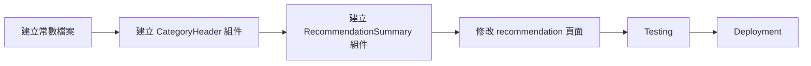

# 實作計畫：類別分組顯示功能 (Category Sections Implementation Plan)

## 文件資訊
- **功能名稱**：類別分組顯示功能 (Category Sections)
- **規格文件**：[category_sections.md](./category_sections.md)
- **預計工時**：1 小時
- **優先級**：P0（使用者明確需求）
- **建立日期**：2025-11-27

---

## 1. 實作總覽

### 1.1 目標
將推薦頁面改為依類別分組顯示，使用者一眼看出推薦結構。

### 1.2 影響範圍

```
Frontend (TypeScript/React)
├── constants/categories.ts          [新增] 類別圖示和順序常數
├── components/category-header.tsx   [新增] 類別標題組件
├── components/recommendation-summary.tsx  [新增] 推薦摘要組件
└── app/recommendation/page.tsx      [修改] 主頁面改為分組顯示
```

**後端無需修改**（已有 `category` 和 `category_summary` 欄位）

### 1.3 實作順序



---

## 2. 詳細實作步驟

### Step 1: 建立類別常數檔案

**檔案**：`frontend/src/constants/categories.ts`（新檔案）
**預計時間**：10 分鐘

#### 檔案內容

```typescript
/**
 * 類別順序定義
 * 依照用餐順序排列（前菜 → 主菜 → 主食 → 湯品 → 甜點）
 */
export const CATEGORY_ORDER: Record<string, string[]> = {
  "中式餐館": ["冷菜", "熱菜", "主食", "點心", "湯品"],
  "日本料理": ["刺身", "壽司", "燒烤", "麵類", "湯物"],
  "美式餐廳": ["前菜", "主餐", "配菜", "甜點", "飲料"],
  "義式料理": ["前菜", "義大利麵", "披薩", "主菜", "甜點"],
  "泰式料理": ["開胃菜", "咖哩", "炒飯麵", "湯類", "甜品"],
};

/**
 * 類別圖示對應
 */
export const CATEGORY_ICONS: Record<string, Record<string, string>> = {
  "中式餐館": {
    "冷菜": "🥶",
    "熱菜": "🔥",
    "主食": "🍚",
    "點心": "🥟",
    "湯品": "🍲",
  },
  "日本料理": {
    "刺身": "🐟",
    "壽司": "🍣",
    "燒烤": "🔥",
    "麵類": "🍜",
    "湯物": "🍵",
  },
  "美式餐廳": {
    "前菜": "🥗",
    "主餐": "🍔",
    "配菜": "🍟",
    "甜點": "🍰",
    "飲料": "🥤",
  },
  "義式料理": {
    "前菜": "🧀",
    "義大利麵": "🍝",
    "披薩": "🍕",
    "主菜": "🥩",
    "甜點": "🍰",
  },
  "泰式料理": {
    "開胃菜": "🦐",
    "咖哩": "🍛",
    "炒飯麵": "🍜",
    "湯類": "🍲",
    "甜品": "🥭",
  },
};

/**
 * 取得類別圖示
 * @param category 類別名稱（例如：「冷菜」）
 * @param cuisineType 餐廳類型（例如：「中式餐館」）
 * @returns 類別圖示 Emoji
 */
export function getCategoryIcon(category: string, cuisineType: string): string {
  return CATEGORY_ICONS[cuisineType]?.[category] || "🍽️";
}

/**
 * 取得排序後的類別列表
 * @param categories 實際出現的類別列表
 * @param cuisineType 餐廳類型
 * @returns 排序後的類別列表
 */
export function getSortedCategories(
  categories: string[],
  cuisineType: string
): string[] {
  const order = CATEGORY_ORDER[cuisineType];

  if (!order) {
    // 未知餐廳類型，使用字母排序
    return [...categories].sort();
  }

  // 依預設順序排序，未定義的類別放在最後
  const sorted: string[] = [];
  const remaining = new Set(categories);

  order.forEach(cat => {
    if (remaining.has(cat)) {
      sorted.push(cat);
      remaining.delete(cat);
    }
  });

  // 加入未定義的類別（字母排序）
  sorted.push(...Array.from(remaining).sort());

  return sorted;
}
```

#### 驗證方式

```typescript
// 測試
console.log(getCategoryIcon("冷菜", "中式餐館"));  // 應輸出 "🥶"
console.log(getCategoryIcon("未知類別", "中式餐館"));  // 應輸出 "🍽️"

const categories = ["湯品", "冷菜", "熱菜"];
console.log(getSortedCategories(categories, "中式餐館"));
// 應輸出 ["冷菜", "熱菜", "湯品"] (依預設順序)
```

---

### Step 2: 建立 CategoryHeader 組件

**檔案**：`frontend/src/components/category-header.tsx`（新檔案）
**預計時間**：10 分鐘

#### 組件內容

```typescript
"use client";

import { getCategoryIcon } from "@/constants/categories";

interface CategoryHeaderProps {
  category: string;
  count: number;
  cuisineType: string;
}

export function CategoryHeader({ category, count, cuisineType }: CategoryHeaderProps) {
  const icon = getCategoryIcon(category, cuisineType);

  return (
    <div className="flex items-center justify-center my-8" role="heading" aria-level={2}>
      <div className="flex items-center gap-2 px-4 py-2 bg-sage/10 rounded-full shadow-sm">
        <span className="text-xl" aria-hidden="true">{icon}</span>
        <h3 className="text-md font-semibold text-sage-800">
          {category} ({count})
        </h3>
      </div>
    </div>
  );
}
```

#### 設計細節

**樣式**：
- `bg-sage/10`：淺綠色背景（品牌色）
- `rounded-full`：藥丸形狀
- `shadow-sm`：輕微陰影
- `text-sage-800`：深綠色文字

**無障礙**：
- `role="heading"`：標記為標題
- `aria-level={2}`：二級標題
- `aria-hidden="true"`：圖示不被螢幕閱讀器讀取

---

### Step 3: 建立 RecommendationSummary 組件

**檔案**：`frontend/src/components/recommendation-summary.tsx`（新檔案）
**預計時間**：10 分鐘

#### 組件內容

```typescript
"use client";

import { Card } from "@/components/ui/card";

interface RecommendationSummaryProps {
  totalDishes: number;
  categorySummary: Record<string, number>;
}

export function RecommendationSummary({
  totalDishes,
  categorySummary,
}: RecommendationSummaryProps) {
  // 生成摘要文字：「冷菜 1 道 · 熱菜 2 道 · 主食 1 道」
  const summaryText = Object.entries(categorySummary)
    .map(([category, count]) => `${category} ${count} 道`)
    .join(" · ");

  return (
    <Card className="mb-6 p-4 bg-cream-100 border-caramel/20">
      <div className="text-center">
        <div className="flex items-center justify-center gap-2 mb-2">
          <span className="text-2xl" aria-hidden="true">📊</span>
          <h2 className="text-lg font-semibold text-foreground">
            為您推薦 {totalDishes} 道菜
          </h2>
        </div>
        <p className="text-sm text-muted-foreground">{summaryText}</p>
      </div>
    </Card>
  );
}
```

#### 設計細節

**樣式**：
- `bg-cream-100`：淺米色背景（品牌色）
- `border-caramel/20`：淺焦糖色邊框
- `text-center`：置中對齊

**文字格式**：
- 用 `·` (中點) 分隔類別
- 格式：`冷菜 1 道 · 熱菜 2 道`

---

### Step 4: 修改 recommendation 頁面

**檔案**：`frontend/src/app/recommendation/page.tsx`
**預計時間**：25 分鐘

#### 修改內容

##### 4.1 Import 新組件

**位置**：檔案頂部

```typescript
import { CategoryHeader } from "@/components/category-header";
import { RecommendationSummary } from "@/components/recommendation-summary";
import { getSortedCategories } from "@/constants/categories";
```

##### 4.2 資料分組處理

**位置**：`recommendation` 狀態後，渲染前

```typescript
// 將 items 依類別分組
const groupedByCategory = useMemo(() => {
  if (!recommendation) return new Map();

  const grouped = new Map<string, DishSlot[]>();
  recommendation.items.forEach((slot) => {
    const category = slot.category;
    if (!grouped.has(category)) {
      grouped.set(category, []);
    }
    grouped.get(category)!.push(slot);
  });

  return grouped;
}, [recommendation]);

// 取得排序後的類別列表
const orderedCategories = useMemo(() => {
  if (!recommendation) return [];

  const categories = Array.from(groupedByCategory.keys());
  return getSortedCategories(categories, recommendation.cuisine_type);
}, [groupedByCategory, recommendation]);
```

##### 4.3 修改 JSX 渲染

**原本的渲染邏輯**（第 300 行左右）：

```tsx
{/* 舊版：平鋪顯示 */}
<div className="space-y-4 mb-8">
  {dishes.map((slot, index) => (
    <DishCard
      key={slot.category + slot.display.dish_name}
      item={slot.display}
      status={slot.status}
      onSelect={handleSelectDish}
      onSwap={() => handleSwap(index)}
      isSwapping={swappingIndices.has(index)}
    />
  ))}
</div>
```

**修改後**：

```tsx
{/* 新版：分組顯示 */}

{/* 1. 推薦摘要 */}
{recommendation && (
  <RecommendationSummary
    totalDishes={dishes.length}
    categorySummary={recommendation.category_summary}
  />
)}

{/* 2. 依類別分組顯示 */}
<div className="mb-8">
  {orderedCategories.map((category) => {
    const slotsInCategory = groupedByCategory.get(category)!;

    return (
      <div key={category} className="mb-8">
        {/* 類別標題 */}
        <CategoryHeader
          category={category}
          count={slotsInCategory.length}
          cuisineType={recommendation!.cuisine_type}
        />

        {/* 該類別的菜品卡片 */}
        <div className="space-y-4">
          {slotsInCategory.map((slot) => {
            // 找到這個 slot 在原始 dishes 陣列中的索引
            const originalIndex = dishes.findIndex(
              (d) => d.display.dish_name === slot.display.dish_name
            );

            return (
              <DishCard
                key={slot.category + slot.display.dish_name}
                item={slot.display}
                status={slot.status}
                onSelect={handleSelectDish}
                onSwap={() => handleSwap(originalIndex)}
                isSwapping={swappingIndices.has(originalIndex)}
              />
            );
          })}
        </div>
      </div>
    );
  })}
</div>
```

#### 設計考量

**索引對應**：
- `handleSwap(index)` 需要原始索引，而非分組後的索引
- 使用 `findIndex` 找到原始位置

**間距**：
- 類別之間：`mb-8`（32px）
- 卡片之間：`space-y-4`（16px）

---

### Step 5: Testing

**預計時間**：15 分鐘

#### 5.1 本地開發測試

```bash
# 啟動開發伺服器
cd /Users/stephen/Desktop/OderWhat/frontend
npm run dev
```

#### 5.2 測試案例

**測試案例 1：中式餐館（多類別）**
- 操作：輸入「鼎泰豐」，3 人，分享模式
- 檢查：
  - [ ] 推薦摘要顯示正確（例如：`為您推薦 4 道菜 · 冷菜 1 道 · 熱菜 2 道 · 點心 1 道`）
  - [ ] 類別標題正確（🥶 冷菜 (1)、🔥 熱菜 (2)、🥟 點心 (1)）
  - [ ] 類別順序正確（冷菜 → 熱菜 → 點心）
  - [ ] 每個類別下的菜品卡片顯示正確

**測試案例 2：日式料理**
- 操作：輸入「一蘭拉麵」，2 人，個人模式
- 檢查：
  - [ ] 類別圖示使用日式風格（🍜 麵類）
  - [ ] 類別順序符合日式用餐順序

**測試案例 3：換菜功能**
- 操作：在「熱菜」類別下點擊「換一道」
- 檢查：
  - [ ] 新菜品仍在「熱菜」類別下（不會跑到其他類別）
  - [ ] 換菜動畫正常運作

**測試案例 4：選菜功能**
- 操作：點擊「我要點」選擇菜品
- 檢查：
  - [ ] 卡片變灰（opacity-50）
  - [ ] 底部按鈕計數正確更新
  - [ ] 跨類別選擇也正常運作

#### 5.3 Build 測試

```bash
npm run build
# 應該編譯成功
```

#### 5.4 視覺檢查清單

- [ ] 類別標題置中顯示
- [ ] 圖示大小適中（text-xl）
- [ ] 品牌色使用正確（sage 綠色）
- [ ] 間距合理（類別間 32px，卡片間 16px）
- [ ] 手機、平板、桌面版面都正常
- [ ] 推薦摘要文字不會太長導致換行混亂

---

### Step 6: Deployment

**預計時間**：5 分鐘

#### 6.1 Commit & Push

```bash
cd /Users/stephen/Desktop/OderWhat

# 確認修改內容
git status

# 加入所有修改
git add -A

# Commit
git commit -m "feat: add category sections to recommendation page

Organize dishes by category with visual sections:
- New components: CategoryHeader, RecommendationSummary
- New constants: CATEGORY_ORDER, CATEGORY_ICONS
- Updated recommendation page: group dishes by category
- Dynamic category icons based on cuisine type
- Category order follows dining sequence (appetizer → main → dessert)

Benefits:
- Users can see recommendation structure at a glance
- Easy to identify missing categories (e.g., no soup, no dessert)
- Improves transparency and trust in AI recommendations
- Prepares foundation for future 'add more dishes' feature

🤖 Generated with [Claude Code](https://claude.com/claude-code)

Co-Authored-By: Claude <noreply@anthropic.com>"

# Push
git push origin main
```

#### 6.2 驗證部署

```bash
# 檢查 GitHub Actions
gh run list --limit 1

# 等待部署完成後測試 Production
open https://dining-frontend-1045148759148.asia-east1.run.app
```

---

## 3. 風險評估與緩解

### 3.1 技術風險

| 風險 | 機率 | 影響 | 緩解措施 |
|------|------|------|---------|
| `category` 欄位缺失 | 低 | 高 | Backend 已強制要求 category |
| 換菜功能索引錯亂 | 中 | 高 | 使用 findIndex 找原始索引 |
| 未知餐廳類型 | 中 | 低 | 使用字母排序 + 預設圖示 |
| 類別標題過長 | 低 | 低 | 使用簡潔的類別名稱 |

### 3.2 產品風險

| 風險 | 機率 | 影響 | 緩解措施 |
|------|------|------|---------|
| 使用者不喜歡分組顯示 | 低 | 中 | 收集使用者反饋，提供選項切換 |
| 類別過多導致滾動過長 | 低 | 低 | 未來可加入「收合」功能 |
| 圖示不符合使用者認知 | 中 | 低 | 根據回饋調整圖示 |

---

## 4. Rollback Plan

如果上線後發現重大問題，回滾步驟：

### 4.1 快速回滾

```bash
# Revert commit
git revert HEAD
git push origin main
```

### 4.2 Hotfix 選項

如果只是樣式問題：
- 調整 CategoryHeader 的 CSS
- 調整間距或顏色
- 快速 commit & push

---

## 5. 成功指標

### 5.1 技術指標

- ✅ Build 成功率：100%
- ✅ TypeScript 錯誤：0 個
- ✅ 換菜功能正常運作
- ✅ 各餐廳類型圖示正確

### 5.2 使用者指標（需後續追蹤）

- 📊 使用者回報「不知道推薦結構」的問題：減少 > 80%
- 📊 推薦頁面停留時間：增加（表示使用者在仔細閱讀）
- 📊 追加點餐功能使用率：增加（因為發現缺少的類別）

---

## 6. Timeline

```
Day 1 (2025-11-27)
├── 20:00-20:10  Step 1: 建立 categories.ts (10min)
├── 20:10-20:20  Step 2: 建立 CategoryHeader 組件 (10min)
├── 20:20-20:30  Step 3: 建立 RecommendationSummary 組件 (10min)
├── 20:30-20:55  Step 4: 修改 recommendation 頁面 (25min)
├── 20:55-21:10  Step 5: Testing (15min)
└── 21:10-21:15  Step 6: Deployment (5min)

Total: ~1.25 小時
```

---

## 7. Checklist

### 開發前
- [x] 閱讀 `category_sections.md` 規格文件
- [x] 理解分組顯示邏輯
- [ ] 確認 recommendation 頁面當前結構

### 實作
- [ ] 建立 `constants/categories.ts`
- [ ] 建立 `components/category-header.tsx`
- [ ] 建立 `components/recommendation-summary.tsx`
- [ ] 修改 `app/recommendation/page.tsx`（Import 組件）
- [ ] 修改 `app/recommendation/page.tsx`（資料分組）
- [ ] 修改 `app/recommendation/page.tsx`（JSX 渲染）

### Testing
- [ ] 本地測試：中式餐館多類別
- [ ] 本地測試：日式料理
- [ ] 本地測試：換菜功能
- [ ] 本地測試：選菜功能
- [ ] Build 測試通過
- [ ] 視覺檢查（間距、顏色、圖示）

### Deployment
- [ ] Git commit
- [ ] Git push
- [ ] GitHub Actions 通過
- [ ] Production 驗證

### 文件
- [x] 規格文件完成
- [x] 實作計畫完成
- [ ] 任務拆解文件完成（task.md）

---

## 8. 參考資料

- **規格文件**：[specs/category_sections.md](./category_sections.md)
- **任務拆解**：[specs/task_category_sections.md](./task_category_sections.md)（待建立）
- **Prompt Builder**：`agent/prompt_builder.py` (category_order 定義)

---

**文件版本**：1.0
**建立日期**：2025-11-27
**最後更新**：2025-11-27
**狀態**：📝 實作計畫完成，待實作
