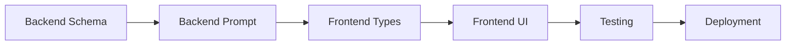

# 實作計畫：數量顯示功能 (Quantity Display Implementation Plan)

## 文件資訊
- **功能名稱**：數量顯示功能 (Quantity Display)
- **規格文件**：[quantity_display.md](./quantity_display.md)
- **預計工時**：2-3 小時
- **優先級**：P0（使用者明確需求）
- **建立日期**：2025-11-27

---

## 1. 實作總覽

### 1.1 目標
讓使用者在推薦結果中看到每道菜的點餐數量，可以直接拿著菜單跟店員點餐。

### 1.2 影響範圍

```
Backend (Python)
├── schemas/recommendation.py        [修改] 加入 quantity 欄位
└── agent/prompt_builder.py          [修改] 加入數量計算邏輯

Frontend (TypeScript/React)
├── types/index.ts                   [修改] MenuItem 加入 quantity
├── components/dish-card.tsx         [修改] 顯示數量和總價
└── app/menu/page.tsx                [修改] 最終菜單顯示數量
```

### 1.3 實作順序



**理由**：資料流向是 Backend → Frontend，所以從後端開始實作，確保資料結構正確後再修改前端。

---

## 2. 詳細實作步驟

### Step 1: Backend - 修改 Schema

**檔案**：`schemas/recommendation.py`
**預計時間**：5 分鐘

#### 修改內容

**位置**：`MenuItemV2` class（約第 59 行）

```python
# 原本
class MenuItemV2(BaseModel):
    dish_id: Optional[str] = Field(None, description="Corresponding menu item ID")
    dish_name: str = Field(..., description="Name of the dish")
    price: int = Field(..., description="Price of the dish")
    reason: str = Field(..., description="Reason for recommending this dish")
    category: str = Field(..., description="Dish category (e.g., 冷菜, 熱菜, 刺身, 壽司)")
    review_count: Optional[int] = Field(None, description="Number of reviews mentioning this dish")

# 修改後
class MenuItemV2(BaseModel):
    dish_id: Optional[str] = Field(None, description="Corresponding menu item ID")
    dish_name: str = Field(..., description="Name of the dish")
    price: int = Field(..., description="Price of the dish")
    quantity: int = Field(..., description="Quantity of this dish to order", ge=1)  # 新增
    reason: str = Field(..., description="Reason for recommending this dish")
    category: str = Field(..., description="Dish category (e.g., 冷菜, 熱菜, 刺身, 壽司)")
    review_count: Optional[int] = Field(None, description="Number of reviews mentioning this dish")
```

#### 驗證方式

```python
# 測試 Pydantic 驗證
item = MenuItemV2(
    dish_name="小籠包",
    price=200,
    quantity=2,  # 必填
    reason="好吃",
    category="點心"
)
print(item.quantity)  # 應該輸出 2

# 測試邊界
item = MenuItemV2(..., quantity=0)  # 應該報錯（ge=1）
```

#### 潛在問題
- ⚠️ 因為是新增 **必填欄位**，可能會影響現有的測試或快取資料
- ✅ 解決：Firestore 快取會自動更新（下次 API 呼叫時）

---

### Step 2: Backend - 修改 Prompt

**檔案**：`agent/prompt_builder.py`
**預計時間**：15 分鐘

#### 修改位置 1：Section 4 標題和內容

**位置**：約第 153 行

```python
# 原本標題
## 4. Portion Size & Satiety Check

# 修改後標題
## 4. Portion Size, Quantity & Satiety Check
```

#### 修改位置 2：新增數量計算邏輯

**位置**：Section 4 開頭（第 154 行後插入）

```markdown
### Quantity Calculation (MANDATORY for every dish)
Every dish MUST include a `quantity` field indicating how many portions to order:

- **Shared Style**:
  - **Main Dishes** (熱菜, 主菜, 主餐, 炒飯麵, 咖哩, etc.): `quantity = 1` (one sharing portion)
  - **Small Dishes / Sides** (冷菜, 前菜, 配菜, 開胃菜, etc.): `quantity = ceil(Party_Size / 2)` (e.g., 3 people = 2 portions, 4 people = 2 portions, 5 people = 3 portions)
  - **Staples** (主食, 米飯, 麵類, etc.): `quantity = Party_Size` (one per person)
  - **Soups** (湯品, 湯類, 湯物): `quantity = 1` (one large soup to share)
  - **Desserts** (甜點, 甜品, Dolci): `quantity = ceil(Party_Size / 2)` (shared desserts)

- **Individual Style**:
  - **All dishes**: `quantity = Party_Size` (each person gets their own portion)

**Examples:**
- Party of 3, Shared Style:
  - "宮保雞丁" (main): quantity = 1
  - "涼拌小黃瓜" (cold dish): quantity = 2 (ceil(3/2))
  - "白飯" (staple): quantity = 3

- Party of 4, Individual Style:
  - "牛肉麵" (main): quantity = 4
  - "小籠包" (appetizer): quantity = 4
```

#### 修改位置 3：更新範例 JSON

**位置**：約第 207 行（Example Output Structure）

```json
// 原本
{
  "dish_id": null,
  "dish_name": "小籠包",
  "price": 200,
  "reason": "鼎泰豐招牌菜品，342 則評論提到皮薄汁多",
  "category": "點心",
  "review_count": 342
}

// 修改後（加入 quantity）
{
  "dish_id": null,
  "dish_name": "小籠包",
  "price": 200,
  "quantity": 2,  // 新增
  "reason": "鼎泰豐招牌菜品，342 則評論提到皮薄汁多",
  "category": "點心",
  "review_count": 342
}
```

#### 驗證方式

```bash
# 檢查 prompt 是否正確生成
python -c "from agent.prompt_builder import PromptBuilder; print(PromptBuilder.build_prompt(...))"
# 應該包含 "quantity" 相關指示
```

#### 潛在問題
- ⚠️ Gemini AI 可能不會嚴格遵守 quantity 規則
- ✅ 解決：在 prompt 中使用 **MANDATORY**、**CRITICAL** 等強調詞

---

### Step 3: Frontend - 修改 Types

**檔案**：`frontend/src/types/index.ts`
**預計時間**：2 分鐘

#### 修改內容

**位置**：`MenuItem` interface（第 3 行）

```typescript
// 原本
export interface MenuItem {
  dish_id: string | null;
  dish_name: string;
  price: number;
  category: string;
  reason: string;
  review_count?: number;
  price_estimated?: boolean;
}

// 修改後
export interface MenuItem {
  dish_id: string | null;
  dish_name: string;
  price: number;
  quantity: number;  // 新增
  category: string;
  reason: string;
  review_count?: number;
  price_estimated?: boolean;
}
```

#### 驗證方式

```bash
# TypeScript 編譯檢查
npm run build
# 應該沒有型別錯誤
```

#### 潛在問題
- ⚠️ 現有使用 MenuItem 的地方可能會報錯（缺少 quantity）
- ✅ 解決：TypeScript 會自動檢查，修正所有使用處

---

### Step 4: Frontend - 修改 DishCard

**檔案**：`frontend/src/components/dish-card.tsx`
**預計時間**：20 分鐘

#### 修改位置 1：菜名顯示

**位置**：第 47 行（h3 標題）

```tsx
// 原本
<h3 className="font-bold text-lg text-foreground leading-tight truncate pr-2">
  {item.dish_name}
</h3>

// 修改後
<h3 className="font-bold text-lg text-foreground leading-tight truncate pr-2">
  {item.dish_name} {item.quantity > 1 && <span className="text-caramel">x{item.quantity}</span>}
</h3>
```

#### 修改位置 2：價格顯示

**位置**：第 52 行（價格 span）

```tsx
// 原本
<span className="text-lg font-mono font-semibold text-foreground">
  NT$ {item.price}
</span>

// 修改後
<div className="text-right">
  <span className="text-lg font-mono font-semibold text-foreground">
    NT$ {item.price * item.quantity}
  </span>
  {item.quantity > 1 && (
    <div className="text-xs text-muted-foreground">
      {item.quantity} × NT$ {item.price}
    </div>
  )}
</div>
```

#### 設計考量

**顏色選擇**：
- `text-caramel`（品牌色）：用於 x2、x3 等數量標記
- `text-muted-foreground`：用於計算細節（2 × NT$ 200）

**條件顯示**：
- `quantity === 1`：只顯示菜名和價格（簡潔）
- `quantity > 1`：顯示數量和計算細節（完整資訊）

#### 潛在問題
- ⚠️ 長菜名 + x2 可能會超出卡片寬度
- ✅ 解決：使用 `truncate` class 確保文字不會溢出

---

### Step 5: Frontend - 修改 Menu Page

**檔案**：`frontend/src/app/menu/page.tsx`
**預計時間**：25 分鐘

#### 修改位置 1：菜品列表顯示

**位置**：第 425 行（菜名 h4）

```tsx
// 原本
<h4 className="text-lg font-bold text-foreground">
  {dish.dish_name}
</h4>

// 修改後
<h4 className="text-lg font-bold text-foreground">
  {dish.dish_name} {dish.quantity > 1 && <span className="text-caramel">x{dish.quantity}</span>}
</h4>
```

#### 修改位置 2：價格顯示

**位置**：第 444 行（價格 p）

```tsx
// 原本
<div className="text-right flex-shrink-0">
  <p className="text-lg font-bold font-mono text-foreground">
    NT$ {dish.price}
  </p>
  {dish.price_estimated && (
    <p className="text-xs text-muted-foreground">估價</p>
  )}
</div>

// 修改後
<div className="text-right flex-shrink-0">
  <p className="text-lg font-bold font-mono text-foreground">
    NT$ {(dish.price * dish.quantity).toLocaleString()}
  </p>
  {dish.quantity > 1 && (
    <p className="text-xs text-muted-foreground">
      {dish.quantity} × NT$ {dish.price}
    </p>
  )}
  {dish.price_estimated && (
    <p className="text-xs text-muted-foreground">估價</p>
  )}
</div>
```

#### 修改位置 3：Canvas 分享圖片

**位置**：第 212 行（dishes.forEach）

```typescript
// 原本
menu.dishes.forEach((dish, index) => {
    ctx.font = '20px sans-serif';
    ctx.fillStyle = '#2D2D2D';
    ctx.fillText(`${index + 1}. ${dish.dish_name}`, 50, y);
    ctx.textAlign = 'right';
    ctx.fillText(`NT$ ${dish.price}`, canvas.width - 50, y);
    ctx.textAlign = 'center';
    y += 55;
});

// 修改後
menu.dishes.forEach((dish, index) => {
    ctx.font = '20px sans-serif';
    ctx.fillStyle = '#2D2D2D';
    const dishName = dish.quantity > 1 ? `${dish.dish_name} x${dish.quantity}` : dish.dish_name;
    ctx.fillText(`${index + 1}. ${dishName}`, 50, y);
    ctx.textAlign = 'right';
    ctx.fillText(`NT$ ${(dish.price * dish.quantity).toLocaleString()}`, canvas.width - 50, y);
    ctx.textAlign = 'center';
    y += 55;
});
```

#### 設計考量

**Canvas 文字**：
- 使用較大字型（20px）確保可讀性
- 數量直接附加在菜名後：「小籠包 x2」
- 價格顯示總價（不顯示計算細節，避免圖片過於複雜）

#### 潛在問題
- ⚠️ Canvas 文字可能因為 x2 而超出邊界
- ✅ 解決：調整起始 x 座標或使用較小字型

---

### Step 6: Testing

**預計時間**：30 分鐘

#### 6.1 本地開發測試

```bash
# 1. 啟動後端
cd /Users/stephen/Desktop/OderWhat
python -m uvicorn main:app --reload

# 2. 啟動前端
cd frontend
npm run dev

# 3. 測試案例
```

**測試案例清單**：

| # | 餐廳 | 人數 | 模式 | 預期數量 | 檢查項目 |
|---|------|------|------|---------|---------|
| 1 | 鼎泰豐 | 3 | 分享 | 主菜 x1, 小菜 x2, 主食 x3 | DishCard 顯示正確 |
| 2 | 拉麵店 | 2 | 個人 | 所有菜 x2 | 總價計算正確 |
| 3 | 咖啡廳 | 1 | 分享 | 所有菜 x1 | 不顯示 x1（簡潔） |
| 4 | 日本料理 | 5 | 分享 | 小菜 x3 (ceil(5/2)) | 計算細節顯示 |

#### 6.2 Build 測試

```bash
cd frontend
npm run build
# 應該編譯成功，無 TypeScript 錯誤
```

#### 6.3 手動視覺檢查

- [ ] 推薦頁面：數量標記使用 caramel 色
- [ ] 推薦頁面：計算細節文字大小適中
- [ ] 最終菜單：數量顯示不會導致排版錯亂
- [ ] 分享圖片：菜名和數量不會超出邊界
- [ ] 不同螢幕尺寸：手機、平板、桌面都正常顯示

#### 潛在問題
- ⚠️ AI 可能生成不合理的數量（例如 quantity = 0）
- ✅ 解決：Pydantic 驗證會擋掉（ge=1）

---

### Step 7: Deployment

**預計時間**：10 分鐘

#### 7.1 Commit Changes

```bash
cd /Users/stephen/Desktop/OderWhat
git add -A
git commit -m "feat: add quantity field to dish recommendations

Implement quantity display for better ordering:
- Backend: Add quantity field to MenuItemV2 schema (required, min 1)
- Prompt: Add comprehensive quantity calculation logic for shared/individual modes
  - Shared: main dishes x1, small dishes x ceil(party_size/2), staples x party_size
  - Individual: all dishes x party_size
- Frontend: Update MenuItem type to include quantity
- UI: Display quantity in dish cards (e.g., '菜名 x2') and total price (quantity × unit_price)
- Menu page: Show quantity in final menu and canvas share image

This allows users to see exactly how many portions to order when ordering from staff.

🤖 Generated with [Claude Code](https://claude.com/claude-code)

Co-Authored-By: Claude <noreply@anthropic.com>"
```

#### 7.2 Push to GitHub

```bash
git push origin main
```

#### 7.3 驗證 CI/CD

```bash
# 檢查 GitHub Actions
gh run list --limit 5

# 查看最新 workflow
gh run view

# 確認部署成功
# - Frontend: Cloud Run (dining-frontend)
# - Backend: Cloud Run (dining-backend)
```

#### 7.4 Production Testing

```bash
# 測試 Production API
curl https://dining-backend-1045148759148.asia-east1.run.app/health

# 測試 Frontend
open https://dining-frontend-1045148759148.asia-east1.run.app
```

---

## 3. 風險評估與緩解

### 3.1 技術風險

| 風險 | 機率 | 影響 | 緩解措施 |
|------|------|------|---------|
| AI 不遵守 quantity 規則 | 中 | 高 | 在 prompt 中強調 MANDATORY |
| 新增必填欄位破壞快取 | 低 | 中 | Firestore 自動更新，無需清除 |
| TypeScript 型別錯誤 | 低 | 低 | Build 時自動檢查 |
| UI 排版錯亂 | 中 | 中 | 手動視覺測試，使用 truncate |

### 3.2 產品風險

| 風險 | 機率 | 影響 | 緩解措施 |
|------|------|------|---------|
| 數量不符合使用者習慣 | 中 | 中 | 收集使用者反饋，調整公式 |
| 餐廳份量差異大 | 高 | 中 | Prompt 包含份量判斷邏輯 |
| 使用者想調整數量 | 高 | 低 | 未來功能：手動調整（Phase 2） |

---

## 4. Rollback Plan

如果上線後發現重大問題，回滾步驟：

### 4.1 Frontend Rollback

```bash
# 1. 找到上一個穩定版本的 commit
git log --oneline | head -10

# 2. Revert quantity feature commit
git revert <commit-hash>

# 3. Force push
git push origin main --force
```

### 4.2 Backend Rollback

**選項 1：Revert commit（同 Frontend）**

**選項 2：修改 Schema 為 Optional**

```python
# 緊急修正：quantity 改為 Optional
quantity: Optional[int] = Field(None, description="...")
```

### 4.3 Hotfix 流程

如果只是小問題（例如計算邏輯錯誤）：

1. 修正 `prompt_builder.py` 中的計算公式
2. Commit 並 push
3. GitHub Actions 自動部署
4. 驗證修正成功

---

## 5. 成功指標 (Success Metrics)

### 5.1 技術指標

- ✅ Build 成功率：100%
- ✅ TypeScript 錯誤：0 個
- ✅ API Response Time：< 3 秒（無影響）
- ✅ Frontend Load Time：< 2 秒（無影響）

### 5.2 功能指標

- ✅ AI 生成 quantity 欄位的成功率：> 95%
- ✅ quantity 值合理性：> 90%（人工抽查）
- ✅ 前端顯示正確率：100%（測試案例）

### 5.3 使用者指標（需後續追蹤）

- 📊 使用者回報「不知道要點幾份」的問題：減少 > 80%
- 📊 最終菜單頁面的停留時間：增加（表示使用者在閱讀數量）
- 📊 分享功能使用率：增加（因為菜單更完整）

---

## 6. Timeline

```
Day 1 (2025-11-27)
├── 09:00-09:30  Step 1-2: Backend 修改 (30min)
├── 09:30-10:00  Step 3-4: Frontend Types & DishCard (30min)
├── 10:00-10:30  Step 5: Menu Page 修改 (30min)
├── 10:30-11:00  Step 6: Local Testing (30min)
└── 11:00-11:15  Step 7: Deployment & Verification (15min)

Total: ~2.5 小時
```

**實際完成時間**：2025-11-27（已完成）

---

## 7. Checklist

### 開發前
- [x] 閱讀 `quantity_display.md` 規格文件
- [x] 理解數量計算邏輯
- [x] 確認影響範圍

### Backend
- [x] 修改 `schemas/recommendation.py`
- [x] 修改 `agent/prompt_builder.py`
- [x] 更新 Prompt 範例 JSON

### Frontend
- [x] 修改 `types/index.ts`
- [x] 修改 `components/dish-card.tsx`
- [x] 修改 `app/menu/page.tsx`（列表顯示）
- [x] 修改 `app/menu/page.tsx`（Canvas 圖片）

### Testing
- [x] 本地 Build 測試通過
- [ ] 3 人分享模式測試（應在 Production 測試）
- [ ] 2 人個人模式測試
- [ ] 單人用餐測試
- [ ] 視覺檢查（排版、顏色）

### Deployment
- [x] Git commit
- [x] Git push
- [x] GitHub Actions 通過
- [ ] Production 驗證

### 文件
- [x] 規格文件完成
- [x] 實作計畫完成
- [ ] 任務拆解文件完成（task.md）

---

## 8. 參考資料

- **規格文件**：[specs/quantity_display.md](./quantity_display.md)
- **任務拆解**：[specs/task_quantity_display.md](./task_quantity_display.md)（待建立）
- **Commit**：`1b520b7` (feat: add quantity field to dish recommendations)

---

**文件版本**：1.0
**建立日期**：2025-11-27
**最後更新**：2025-11-27
**狀態**：✅ 已完成實作
